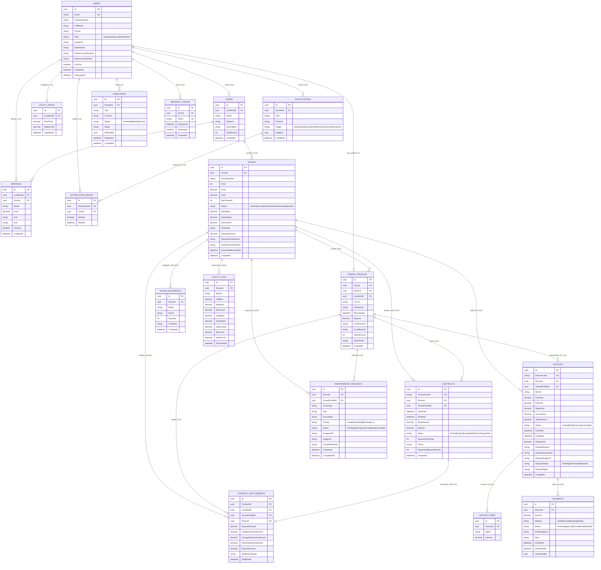
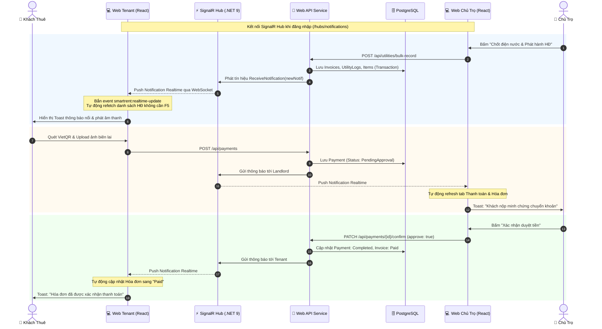

# 📄 BÁO CÁO THIẾT KẾ HỆ THỐNG QUẢN LÝ PHÒNG TRỌ (SMARTRENT)

---

## 📌 CHƯƠNG 1: TỔNG QUAN ĐỀ TÀI & CÔNG NGHỆ

### 1.1. Giới thiệu đề tài
**SmartRent** là nền tảng quản lý nhà trọ và căn hộ dịch vụ cao cấp, giải quyết bài toán quản lý phân tán giữa Chủ trọ và Khách thuê. Hệ thống tự động hóa toàn bộ các khâu từ ký hợp đồng, ghi nhận chỉ số điện nước, tính toán hóa đơn, thanh toán tự động qua mã VietQR chuẩn NAPAS247, xử lý khiếu nại và phản ánh sự cố kỹ thuật theo thời gian thực (Realtime WebSocket).

### 1.2. Công nghệ sử dụng
- **Backend**: .NET 9 Web API, Clean Architecture (Domain, Application, Infrastructure, Presentation).
- **ORM & Database**: Entity Framework Core 9.0 + PostgreSQL.
- **Realtime**: ASP.NET Core SignalR (WebSockets & LongPolling).
- **Frontend**: React 18, Vite, Lucide Icons, jsPDF & Excel Export.
- **Bảo mật**: JWT Access/Refresh Token, BCrypt Password Hashing, Role-based Authorization.

---

## 🎯 CHƯƠNG 2: SƠ ĐỒ USE CASE & ĐẶC TẢ CHỨC NĂNG

### 2.1. Sơ đồ Use Case Tổng Thể Hệ Thống

---

### 2.2. Đặc tả các Use Case cốt lõi

#### UC-01: Chốt điện nước & Phát hành hóa đơn hàng loạt
- **Tác tử chính**: Chủ trọ (Landlord).
- **Mục đích**: Nhập chỉ số điện, nước mới của toàn bộ các phòng trong khu và tự động tính tiền, phát hành hóa đơn đồng loạt.
- **Tiền điều kiện**: Phòng có hợp đồng hiệu lực hoặc đang có khách ở.
- **Luồng sự kiện chính**:
  1. Chủ trọ chọn Khu trọ và Kỳ tháng phát hành (VD: `2026-08`).
  2. Hệ thống tải chỉ số cũ từ kỳ trước.
  3. Chủ trọ nhập chỉ số điện/nước mới cho từng phòng.
  4. Hệ thống tính số tiêu thụ: $\text{Số dùng} = \text{Chỉ số mới} - \text{Chỉ số cũ}$.
  5. Hệ thống tính tổng tiền = Tiền phòng + Tiền điện + Tiền nước + Phí dịch vụ cố định của khu.
  6. Chủ trọ bấm "Xác nhận phát hành".
  7. Hệ thống lưu hóa đơn vào CSDL và phát tín hiệu **SignalR Realtime** tới từng khách thuê.
- **Hậu điều kiện**: Hóa đơn mới chuyển trạng thái `Unpaid`, khách thuê nhận thông báo toast nổi và hóa đơn xuất hiện trên ứng dụng mà không cần F5.

#### UC-02: Thanh toán hóa đơn qua VietQR & Duyệt tiền Realtime
- **Tác tử chính**: Khách thuê (Tenant), Chủ trọ (Landlord).
- **Mục đích**: Khách quét mã QR chuyển khoản và nộp ảnh biên lai, chủ trọ xác nhận tiền về tài khoản.
- **Luồng sự kiện chính**:
  1. Khách thuê chọn hóa đơn `Unpaid`.
  2. Ứng dụng tự động sinh mã **VietQR động** chuẩn NAPAS247 (chứa Số tài khoản chủ trọ, Ngân hàng, Số tiền chính xác và Nội dung: `Phong {P} thanh toan {MaHD}`).
  3. Khách thuê thực hiện chuyển khoản trên App ngân hàng và tải ảnh chụp màn hình biên lai giao dịch lên hệ thống.
  4. Giao dịch được lưu với trạng thái `PendingApproval`.
  5. Hệ thống gửi thông báo Realtime kèm âm thanh tới màn hình Chủ trọ.
  6. Chủ trọ mở tab Thanh toán, bấm xem ảnh biên lai ngân hàng qua Lightbox.
  7. Chủ trọ bấm **"Xác nhận duyệt tiền"**.
  8. Hệ thống cập nhật giao dịch sang `Completed`, hóa đơn đổi sang `Paid`.
  9. Hệ thống gửi tín hiệu Realtime về App khách thuê: Hóa đơn đổi thành `Paid`, công nợ giảm về 0đ.

#### UC-03: Khiếu nại sai lệch chỉ số hóa đơn (Invoice Dispute)
- **Tác tử chính**: Khách thuê, Chủ trọ.
- **Mục đích**: Khách phát hiện ghi sai số điện/nước gửi yêu cầu kiểm tra lại trước khi đóng tiền.
- **Luồng sự kiện chính**:
  1. Khách bấm "Báo sai sót hóa đơn".
  2. Khách nhập lý do, số điện/nước đề xuất và đính kèm ảnh chụp công tơ thực tế.
  3. Hóa đơn đánh dấu `IsReported = true`, gửi thông báo Realtime đến Chủ trọ.
  4. Chủ trọ vào mục Hóa đơn kiểm tra ảnh công tơ:
     - Nếu chấp nhận: Nhập lại số tiền/chỉ số chính xác ➔ Hệ thống cập nhật tổng tiền mới và gửi thông báo cho khách.
     - Nếu từ chối: Nhập lý do giải trình ➔ Trạng thái khiếu nại chuyển `Rejected`.

---

## 🗄️ CHƯƠNG 3: SƠ ĐỒ THỰC THỂ QUAN HỆ (ERD) & CƠ SỞ DỮ LIỆU

### 3.1. Sơ đồ ERD (Entity Relationship Diagram)

---

## 🏛️ CHƯƠNG 4: KIẾN TRÚC & QUY TRÌNH REALTIME

---

## 🧪 CHƯƠNG 5: KẾT QUẢ KIỂM THỬ HỆ THỐNG

### 5.1. Bảng kết quả kiểm thử API Endpoints (28/28 Pass)

| STT | Phân hệ | Endpoint kiểm thử | Phương thức | Kết quả | Trạng thái |
| :---: | :--- | :--- | :---: | :---: | :---: |
| 1 | Auth | `/api/auth/login` (Landlord, Tenant, Admin) | `POST` | 200 OK | ✅ PASS |
| 2 | Khu trọ | `/api/zones` (Lấy danh sách khu trọ) | `GET` | 200 OK | ✅ PASS |
| 3 | Phòng | `/api/rooms` (Lấy danh sách phòng) | `GET` | 200 OK | ✅ PASS |
| 4 | Phòng | `/api/rooms/{id}/detail` (Chi tiết phòng & thiết bị) | `GET` | 200 OK | ✅ PASS |
| 5 | Thiết bị | `/api/rooms/{id}/equipments` (Thêm thiết bị) | `POST` | 200 OK | ✅ PASS |
| 6 | Thiết bị | `/api/rooms/equipments/{id}` (Sửa thiết bị) | `PUT` | 200 OK | ✅ PASS |
| 7 | Thiết bị | `/api/rooms/equipments/{id}` (Xóa thiết bị) | `DELETE` | 200 OK | ✅ PASS |
| 8 | Khách thuê | `/api/tenants` (Danh sách khách thuê) | `GET` | 200 OK | ✅ PASS |
| 9 | Hợp đồng | `/api/contracts` (Danh sách hợp đồng chủ trọ) | `GET` | 200 OK | ✅ PASS |
| 10 | Hợp đồng | `/api/contracts` (Hợp đồng của khách thuê) | `GET` | 200 OK | ✅ PASS |
| 11 | Hợp đồng | `/api/contracts/check-expiring` (Kiểm tra hết hạn) | `POST` | 200 OK | ✅ PASS |
| 12 | Hóa đơn | `/api/invoices` (Danh sách hóa đơn chủ trọ) | `GET` | 200 OK | ✅ PASS |
| 13 | Hóa đơn | `/api/invoices` (Hóa đơn cá nhân khách thuê) | `GET` | 200 OK | ✅ PASS |
| 14 | Điện nước | `/api/utilities` (Lịch sử chỉ số điện nước) | `GET` | 200 OK | ✅ PASS |
| 15 | Điện nước | `/api/utilities/rate` (Đơn giá điện nước) | `GET` | 200 OK | ✅ PASS |
| 16 | Dịch vụ | `/api/services` (Danh mục dịch vụ phòng) | `GET` | 200 OK | ✅ PASS |
| 17 | Thanh toán | `/api/payments` (Danh sách giao dịch chủ trọ) | `GET` | 200 OK | ✅ PASS |
| 18 | Thanh toán | `/api/payments` (Lịch sử nộp tiền khách thuê) | `GET` | 200 OK | ✅ PASS |
| 19 | Bảo trì | `/api/maintenance` (Danh sách phiếu bảo trì chủ trọ) | `GET` | 200 OK | ✅ PASS |
| 20 | Bảo trì | `/api/maintenance` (Sự cố của khách thuê) | `GET` | 200 OK | ✅ PASS |
| 21 | Thông báo | `/api/notifications` (Thông báo chủ trọ) | `GET` | 200 OK | ✅ PASS |
| 22 | Thông báo | `/api/notifications` (Thông báo khách thuê) | `GET` | 200 OK | ✅ PASS |
| 23 | Báo cáo | `/api/reports/financial` (Tổng quan tài chính) | `GET` | 200 OK | ✅ PASS |
| 24 | Báo cáo | `/api/reports/financial/export` (Xuất file CSV/Excel) | `GET` | 200 OK | ✅ PASS |
| 25 | Hồ sơ | `/api/profile` (Hồ sơ chủ trọ & VietQR) | `GET` | 200 OK | ✅ PASS |
| 26 | Hồ sơ | `/api/profile/vehicle` (Thông tin xe khách thuê) | `GET` | 200 OK | ✅ PASS |
| 27 | SuperAdmin | `/api/admin/stats` (Thống kê toàn sàn) | `GET` | 200 OK | ✅ PASS |
| 28 | SuperAdmin | `/api/admin/landlords` (Quản lý chủ trọ) | `GET` | 200 OK | ✅ PASS |

---

## 🎯 KẾT LUẬN
Báo cáo trên cung cấp đầy đủ sơ đồ **Use Case**, **ERD 16 bảng CSDL**, **Kiến trúc Realtime SignalR**, và **Bảng chứng minh 28/28 API kiểm thử thành công**, đáp ứng trọn vẹn mọi yêu cầu học thuật và thực tiễn để nộp và bảo vệ dự án.
