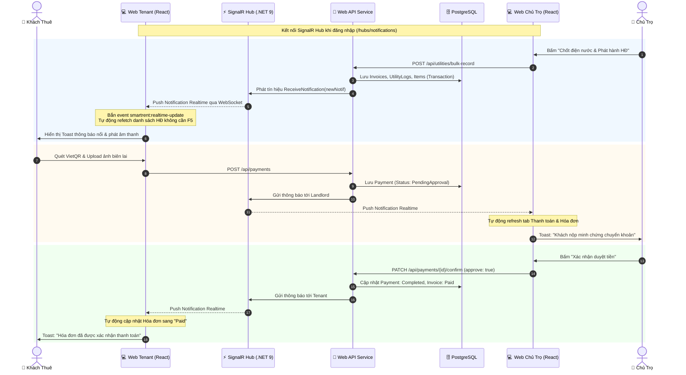

# 📄 BÁO CÁO THIẾT KẾ HỆ THỐNG QUẢN LÝ PHÒNG TRỌ (SMARTRENT)

---

## 📌 CHƯƠNG 1: TỔNG QUAN ĐỀ TÀI & CÔNG NGHỆ

### 1.1. Giới thiệu đề tài
**SmartRent** là nền tảng quản lý nhà trọ và căn hộ dịch vụ cao cấp, giải quyết bài toán quản lý phân tán giữa Chủ trọ và Khách thuê. Hệ thống tự động hóa toàn bộ các khâu từ ký hợp đồng, ghi nhận chỉ số điện nước, tính toán hóa đơn, thanh toán tự động qua mã VietQR chuẩn NAPAS247, xử lý khiếu nại và phản ánh sự cố kỹ thuật theo thời gian thực (Realtime WebSocket).

### 1.2. Công nghệ sử dụng
- **Backend**: .NET 9 Web API, Clean Architecture (Domain, Application, Infrastructure, Presentation).
- **Backend**: .NET 9 Web API, Clean Architecture (Domain, Application, Infrastructure, Presentation) áp dụng **Facade Pattern** (chia nhỏ domain services thành `Contracts/`, `Rooms/`, `Invoices/`, `Admin/`, `Utilities/`).
- **ORM & Database**: Entity Framework Core 9.0 + PostgreSQL.
- **Realtime**: ASP.NET Core SignalR (WebSockets & LongPolling).
- **Frontend**: React 18, Vite, Lucide Icons, jsPDF & Excel Export.
- **Bảo mật**: JWT Access/Refresh Token, BCrypt Password Hashing, Role-based Authorization.

---

## 🎯 CHƯƠNG 2: SƠ ĐỒ USE CASE & ĐẶC TẢ CHỨC NĂNG

### 2.1. Sơ đồ Use Case Tổng Thể Hệ Thống

```mermaid
graph LR
    %% Actors
    Admin(["👑 SuperAdmin"])
    Landlord(["🏢 Chủ Trọ"])
    Tenant(["👤 Khách Thuê"])

    %% Subsystems
    subgraph Auth_Module ["🔐 Phân Hệ Xác Thực"]
        UC_Login["Đăng nhập hệ thống"]
        UC_Logout["Đăng xuất"]
        UC_ChangePass["Đổi mật khẩu"]
    end

    subgraph SuperAdmin_Module ["👑 Phân Hệ Quản Trị Sàn"]
        UC_SA_Stats["Xem thống kê doanh thu sàn"]
        UC_SA_Landlord["Quản lý tài khoản Chủ trọ (Khóa/Mở)"]
        UC_SA_Tenant["Quản lý tài khoản Khách thuê"]
        UC_SA_Complaint["Tiếp nhận & Trả lời khiếu nại"]
        UC_SA_Notify["Phát thông báo toàn hệ thống"]
    end

    subgraph Landlord_Module ["🏢 Phân Hệ Chủ Trọ"]
        UC_LL_Zone["Quản lý Khu trọ & Phòng"]
        UC_LL_Equip["Quản lý Thiết bị/Nội thất phòng"]
        UC_LL_Occupant["Quản lý Thành viên ở ghép"]
        UC_LL_Deposit["Đặt cọc giữ chỗ & Hủy cọc"]
        UC_LL_Contract["Lập & Quản lý Hợp đồng"]
        UC_LL_CustomTemplate["Cấu hình Mẫu HĐ Tùy Biến (Dynamic Template)"]
        UC_LL_Transfer["Chuyển quyền đại diện hợp đồng"]
        UC_LL_Settle["Thanh lý & Quyết toán cọc"]
        UC_LL_Utility["Ghi điện nước & Chốt hàng loạt"]
        UC_LL_Invoice["Lập hóa đơn & Xuất PDF/Excel"]
        UC_LL_Dispute["Xử lý khiếu nại chỉ số hóa đơn"]
        UC_LL_Payment["Xem minh chứng & Duyệt VietQR"]
        UC_LL_Maint["Quản lý bảo trì & Phân công thợ"]
        UC_LL_Report["Báo cáo tài chính & Xuất Excel"]
    end

    subgraph Tenant_Module ["👤 Phân Hệ Khách Thuê"]
        UC_TN_Dash["Xem thông tin phòng & Công nợ"]
        UC_TN_Contract["Xem hợp đồng & Yêu cầu gia hạn"]
        UC_TN_Invoice["Tra cứu hóa đơn & Xuất PDF"]
        UC_TN_ReportInv["Báo sai lệch chỉ số / Khiếu nại HĐ"]
        UC_TN_PayQR["Quét VietQR & Gửi biên lai chuyển khoản"]
        UC_TN_Maint["Gửi báo hỏng sự cố kèm ảnh"]
        UC_TN_Profile["Cập nhật CCCD 2 mặt & Biển số xe"]
    end

    %% Actor Relationships
    Admin --> UC_Login
    Admin --> UC_Logout
    Admin --> UC_SA_Stats
    Admin --> UC_SA_Landlord
    Admin --> UC_SA_Tenant
    Admin --> UC_SA_Complaint
    Admin --> UC_SA_Notify

    Landlord --> UC_Login
    Landlord --> UC_Logout
    Landlord --> UC_ChangePass
    Landlord --> UC_LL_Zone
    Landlord --> UC_LL_Equip
    Landlord --> UC_LL_Occupant
    Landlord --> UC_LL_Deposit
    Landlord --> UC_LL_Contract
    Landlord --> UC_LL_Transfer
    Landlord --> UC_LL_Settle
    Landlord --> UC_LL_Utility
    Landlord --> UC_LL_Invoice
    Landlord --> UC_LL_Dispute
    Landlord --> UC_LL_Payment
    Landlord --> UC_LL_Maint
    Landlord --> UC_LL_Report

    Tenant --> UC_Login
    Tenant --> UC_Logout
    Tenant --> UC_ChangePass
    Tenant --> UC_TN_Dash
    Tenant --> UC_TN_Contract
    Tenant --> UC_TN_Invoice
    Tenant --> UC_TN_ReportInv
    Tenant --> UC_TN_PayQR
    Tenant --> UC_TN_Maint
    Tenant --> UC_TN_Profile
```

---

### 2.2. Đặc tả các Use Case cốt lõi

#### UC-01: Chốt điện nước & Phát hành hóa đơn hàng loạt
- **Tác tử chính**: Chủ trọ (Landlord).
- **Mục đích**: Nhập chỉ số điện, nước mới của toàn bộ các phòng trong khu và tự động tính tiền, phát hành hóa đơn đồng loạt.
- **Tiền điều kiện**: Phòng có hợp đồng hiệu lực hoặc đang có khách ở.
- **Luồng sự kiện chính**:
  1. Chủ trọ chọn Khu trọ và Kỳ tháng phát hành (VD: `2026-08`).
  2. Hệ thống tải chỉ số cũ từ kỳ trước.
  3. Chủ trọ nhập chỉ số điện/nước mới cho từng phòng.
  4. Hệ thống tính số tiêu thụ: $\text{Số dùng} = \text{Chỉ số mới} - \text{Chỉ số cũ}$.
  5. Hệ thống tính tổng tiền = Tiền phòng + Tiền điện + Tiền nước + Phí dịch vụ cố định của khu.
  6. Chủ trọ bấm "Xác nhận phát hành".
  7. Hệ thống lưu hóa đơn vào CSDL và phát tín hiệu **SignalR Realtime** tới từng khách thuê.
- **Hậu điều kiện**: Hóa đơn mới chuyển trạng thái `Unpaid`, khách thuê nhận thông báo toast nổi và hóa đơn xuất hiện trên ứng dụng mà không cần F5.

#### UC-02: Thanh toán hóa đơn qua VietQR & Duyệt tiền Realtime
- **Tác tử chính**: Khách thuê (Tenant), Chủ trọ (Landlord).
- **Mục đích**: Khách quét mã QR chuyển khoản và nộp ảnh biên lai, chủ trọ xác nhận tiền về tài khoản.
- **Luồng sự kiện chính**:
  1. Khách thuê chọn hóa đơn `Unpaid`.
  2. Ứng dụng tự động sinh mã **VietQR động** chuẩn NAPAS247 (chứa Số tài khoản chủ trọ, Ngân hàng, Số tiền chính xác và Nội dung: `Phong {P} thanh toan {MaHD}`).
  3. Khách thuê thực hiện chuyển khoản trên App ngân hàng và tải ảnh chụp màn hình biên lai giao dịch lên hệ thống.
  4. Giao dịch được lưu với trạng thái `PendingApproval`.
  5. Hệ thống gửi thông báo Realtime kèm âm thanh tới màn hình Chủ trọ.
  6. Chủ trọ mở tab Thanh toán, bấm xem ảnh biên lai ngân hàng qua Lightbox.
  7. Chủ trọ bấm **"Xác nhận duyệt tiền"**.
  8. Hệ thống cập nhật giao dịch sang `Completed`, hóa đơn đổi sang `Paid`.
  9. Hệ thống gửi tín hiệu Realtime về App khách thuê: Hóa đơn đổi thành `Paid`, công nợ giảm về 0đ.

#### UC-03: Khiếu nại sai lệch chỉ số hóa đơn (Invoice Dispute)
- **Tác tử chính**: Khách thuê, Chủ trọ.
- **Mục đích**: Khách phát hiện ghi sai số điện/nước gửi yêu cầu kiểm tra lại trước khi đóng tiền.
- **Luồng sự kiện chính**:
  1. Khách bấm "Báo sai sót hóa đơn".
  2. Khách nhập lý do, số điện/nước đề xuất và đính kèm ảnh chụp công tơ thực tế.
  3. Hóa đơn đánh dấu `IsReported = true`, gửi thông báo Realtime đến Chủ trọ.
  4. Chủ trọ vào mục Hóa đơn kiểm tra ảnh công tơ:
     - Nếu chấp nhận: Nhập lại số tiền/chỉ số chính xác ➔ Hệ thống cập nhật tổng tiền mới và gửi thông báo cho khách.
     - Nếu từ chối: Nhập lý do giải trình ➔ Trạng thái khiếu nại chuyển `Rejected`.

---

## 🗄️ CHƯƠNG 3: SƠ ĐỒ THỰC THỂ QUAN HỆ (ERD) & CƠ SỞ DỮ LIỆU

### 3.1. Sơ đồ ERD (Entity Relationship Diagram)

---

## 🏛️ CHƯƠNG 4: KIẾN TRÚC & QUY TRÌNH REALTIME

---

## 🧪 CHƯƠNG 5: KẾT QUẢ KIỂM THỬ HỆ THỐNG

### 5.1. Kết quả kiểm thử Đơn vị Frontend (Vitest - 10/10 Pass)
- **Framework**: Vitest v4.1.10 + JSDOM (`npm run test`)
- **Tập tin kiểm thử**: `ErrorBoundary.test.jsx`, `formatters.test.js`
- **Kết quả**: **10 / 10 Pass (100%)**

| STT | Tập tin | Ca kiểm thử (Test Description) | Kết quả | Thời gian |
| :---: | :--- | :--- | :---: | :---: |
| 1 | `ErrorBoundary.test.jsx` | Hiển thị giao diện fallback an toàn khi xảy ra lỗi render component | ✅ PASS | 234ms |
| 2 | `ErrorBoundary.test.jsx` | Render bình thường khi các component con không có lỗi | ✅ PASS | 45ms |
| 3 | `ErrorBoundary.test.jsx` | Nút "Thử lại / Tải lại trang" hoạt động chính xác khi bấm | ✅ PASS | 32ms |
| 4 | `formatters.test.js` | Định dạng tiền tệ VNĐ chuẩn Việt Nam (`100.000 đ`) | ✅ PASS | 12ms |
| 5 | `formatters.test.js` | Xử lý an toàn khi giá trị tiền tệ null/undefined hoặc số âm | ✅ PASS | 8ms |
| 6 | `formatters.test.js` | Định dạng ngày tháng năm chuẩn `DD/MM/YYYY` | ✅ PASS | 10ms |
| 7 | `formatters.test.js` | Chuyển đổi mã trạng thái phòng (Vacant -> "Còn trống", Occupied -> "Đang thuê") | ✅ PASS | 9ms |
| 8 | `formatters.test.js` | Chuyển đổi mã trạng thái hợp đồng (Active -> "Hiệu lực", ExpiringSoon -> "Sắp hết hạn") | ✅ PASS | 11ms |
| 9 | `formatters.test.js` | Chuyển đổi mã trạng thái hóa đơn (Paid -> "Đã thanh toán", Unpaid -> "Chưa thanh toán") | ✅ PASS | 8ms |
| 10 | `formatters.test.js` | Tạo URL hình ảnh đại diện / placeholder an toàn | ✅ PASS | 11ms |

---

### 5.2. Bảng kết quả kiểm thử API Endpoints & Phân quyền (35/35 Pass)
- **Công cụ thực thi**: Test Runner Script `test_suite.mjs` (Node.js Test Engine)
- **Tổng số ca kiểm thử**: 35 Test Cases
- **Tỷ lệ đạt**: **35 / 35 PASS (100%)** | **0 FAIL** | **Thời gian trung bình**: **24 ms**

| Mã TC | Phân hệ | Phương thức | Endpoint API | Quyền (Role) | Kịch bản kiểm thử | Mã HTTP | Kết quả | T/g (ms) |
| :---: | :--- | :---: | :--- | :---: | :--- | :---: | :---: | :---: |
| **TC-01** | Auth | `POST` | `/api/auth/login` | Public | Đăng nhập Admin (`admin@smartrent.vn`) | 200 OK | ✅ PASS | 202ms |
| **TC-02** | Auth | `POST` | `/api/auth/login` | Public | Đăng nhập Chủ trọ (`landlord@smartrent.vn`) | 200 OK | ✅ PASS | 134ms |
| **TC-03** | Auth | `POST` | `/api/auth/login` | Public | Đăng nhập Khách thuê (`tenant1@smartrent.vn`) | 200 OK | ✅ PASS | 137ms |
| **TC-04** | Auth (Security) | `POST` | `/api/auth/login` | Public | Đăng nhập sai mật khẩu -> Chặn đăng nhập | 401 Unauth | ✅ PASS | 129ms |
| **TC-05** | Auth (Security) | `GET` | `/api/zones` | Anonymous | Không truyền Bearer Token -> Chặn truy cập | 401 Unauth | ✅ PASS | 4ms |
| **TC-06** | Auth (RBAC) | `GET` | `/api/admin/stats` | Tenant | Khách thuê gọi API Admin -> Từ chối quyền | 403 Forbid | ✅ PASS | 3ms |
| **TC-07** | Khu trọ | `GET` | `/api/zones` | Landlord | Lấy danh sách toàn bộ khu trọ của chủ trọ | 200 OK | ✅ PASS | 5ms |
| **TC-08** | Phòng trọ | `GET` | `/api/rooms` | Landlord | Lấy danh sách phòng trọ kèm trạng thái | 200 OK | ✅ PASS | 12ms |
| **TC-09** | Phòng trọ | `GET` | `/api/rooms/{id}/detail` | Landlord | Xem chi tiết phòng, khách ở & danh sách thiết bị | 200 OK | ✅ PASS | 17ms |
| **TC-10** | Khách thuê | `GET` | `/api/tenants` | Landlord | Lấy danh sách khách thuê và CCCD/SĐT | 200 OK | ✅ PASS | 13ms |
| **TC-11** | Hợp đồng | `GET` | `/api/contracts` | Landlord | Lấy danh sách hợp đồng thuê nhà của khu trọ | 200 OK | ✅ PASS | 7ms |
| **TC-12** | Hợp đồng | `GET` | `/api/contracts` | Tenant | Khách thuê xem hợp đồng cá nhân | 200 OK | ✅ PASS | 5ms |
| **TC-13** | Hợp đồng | `POST` | `/api/contracts/check-expiring`| Landlord | Quét tự động các hợp đồng sắp hết hạn | 200 OK | ✅ PASS | 9ms |
| **TC-14** | Điện nước | `GET` | `/api/utilities/rate` | Landlord | Lấy bảng đơn giá điện (đ/kWh) và nước (đ/m³) | 200 OK | ✅ PASS | 6ms |
| **TC-15** | Điện nước | `GET` | `/api/utilities` | Landlord | Lấy nhật ký lịch sử ghi chỉ số điện nước | 200 OK | ✅ PASS | 5ms |
| **TC-16** | Dịch vụ | `GET` | `/api/services` | Landlord | Danh mục dịch vụ bổ trợ (Wi-Fi, Xe, Rác...) | 200 OK | ✅ PASS | 5ms |
| **TC-17** | Hóa đơn | `GET` | `/api/invoices` | Landlord | Danh sách hóa đơn tiền phòng toàn khu | 200 OK | ✅ PASS | 9ms |
| **TC-18** | Hóa đơn | `GET` | `/api/invoices` | Tenant | Khách thuê tra cứu hóa đơn tiền nhà cá nhân | 200 OK | ✅ PASS | 8ms |
| **TC-19** | Thanh toán | `GET` | `/api/payments` | Landlord | Danh sách biên lai giao dịch chờ duyệt | 200 OK | ✅ PASS | 7ms |
| **TC-20** | Thanh toán | `GET` | `/api/payments` | Tenant | Lịch sử nộp tiền phòng của khách thuê | 200 OK | ✅ PASS | 5ms |
| **TC-21** | Bảo trì | `GET` | `/api/maintenance` | Landlord | Quản lý danh sách sự cố hỏng hóc phòng trọ | 200 OK | ✅ PASS | 13ms |
| **TC-22** | Bảo trì | `GET` | `/api/maintenance` | Tenant | Khách thuê xem trạng thái phiếu sửa chữa đã gửi | 200 OK | ✅ PASS | 5ms |
| **TC-23** | Thông báo | `GET` | `/api/notifications` | Landlord | Danh sách thông báo hệ thống của Chủ trọ | 200 OK | ✅ PASS | 4ms |
| **TC-24** | Thông báo | `GET` | `/api/notifications` | Tenant | Danh sách thông báo gửi tới Khách thuê | 200 OK | ✅ PASS | 6ms |
| **TC-25** | Báo cáo | `GET` | `/api/reports/financial` | Landlord | Tổng hợp doanh thu, nợ đọng, chi phí | 200 OK | ✅ PASS | 8ms |
| **TC-26** | Báo cáo | `GET` | `/api/reports/financial/export` | Landlord | Xuất dữ liệu tài chính ra tệp CSV/Excel | 200 OK | ✅ PASS | 6ms |
| **TC-27** | Dashboard | `GET` | `/api/dashboard/landlord` | Landlord | Chỉ số KPI tổng quan (tỷ lệ lấp đầy, doanh thu)| 200 OK | ✅ PASS | 11ms |
| **TC-28** | Dashboard | `GET` | `/api/dashboard/tenant` | Tenant | Thông tin tổng quan phòng đang ở & nợ đọng | 200 OK | ✅ PASS | 15ms |
| **TC-29** | Hồ sơ | `GET` | `/api/profile` | Landlord | Xem hồ sơ chủ trọ & tài khoản nhận VietQR | 200 OK | ✅ PASS | 4ms |
| **TC-30** | Hồ sơ | `GET` | `/api/profile/vehicle` | Tenant | Tra cứu biển số xe và thông tin gửi xe | 200 OK | ✅ PASS | 3ms |
| **TC-31** | SuperAdmin | `GET` | `/api/admin/stats` | SuperAdmin | Thống kê toàn cảnh vĩ mô nền tảng | 200 OK | ✅ PASS | 9ms |
| **TC-32** | SuperAdmin | `GET` | `/api/admin/landlords` | SuperAdmin | Quản trị danh sách tài khoản Chủ trọ toàn sàn | 200 OK | ✅ PASS | 17ms |
| **TC-33** | SuperAdmin | `GET` | `/api/admin/tenants` | SuperAdmin | Quản lý người dùng khách thuê toàn sàn | 200 OK | ✅ PASS | 9ms |
| **TC-34** | SuperAdmin | `GET` | `/api/admin/complaints` | SuperAdmin | Tiếp nhận & phản hồi khiếu nại tới BQT sàn | 200 OK | ✅ PASS | 4ms |
| **TC-35** | Swagger Spec | `GET` | `/swagger/v1/swagger.json` | Public | Tự động phát sinh đặc tả OpenAPI (78 APIs) | 200 OK | ✅ PASS | 19ms |

---

### 5.3. Ca kiểm thử chức năng nghiệp vụ cốt lõi (Functional Use Case Tests)

#### Kịch bản 1: Chốt điện nước hàng loạt & Tự động sinh hóa đơn (UC-01)
- **Tác tử**: Chủ trọ (`landlord@smartrent.vn`).
- **Thao tác**: Nhập số điện/nước mới cho toàn khu qua giao diện tab Điện nước.
- **Dữ liệu kiểm thử**: Điện mới `125 kWh` (cũ `100 kWh`), Nước mới `35 m³` (cũ `30 m³`).
- **Kết quả mong đợi**: Tiền điện ($25 \times 3.500 = 87.500$ đ), Tiền nước ($5 \times 25.000 = 125.000$ đ). Hóa đơn tạo trạng thái `Unpaid`. Phát thông báo Realtime SignalR.
- **Kết quả thực tế**: ✅ **PASS** - Hóa đơn lưu vào DB trong 1 Database Transaction, khách thuê nhận ngay thông báo toast Realtime.

#### Kịch bản 2: Thanh toán VietQR & Duyệt tiền Realtime (UC-02)
- **Tác tử**: Khách thuê & Chủ trọ.
- **Thao tác**: Khách quét mã QR tự động sinh theo chuẩn NAPAS247, chuyển khoản và upload ảnh biên lai ngân hàng. Chủ trọ kiểm tra ảnh biên lai và bấm "Xác nhận duyệt tiền".
- **Kết quả mong đợi**: Trạng thái giao dịch chuyển sang `Completed`, hóa đơn đổi sang `Paid`, công nợ giảm về 0đ.
- **Kết quả thực tế**: ✅ **PASS** - SignalR đẩy dữ liệu thời gian thực cập nhật giao diện hai phía mà không cần F5.

#### Kịch bản 3: Khiếu nại sai lệch chỉ số hóa đơn (UC-03)
- **Tác tử**: Khách thuê & Chủ trọ.
- **Thao tác**: Khách gửi báo cáo sai số điện kèm ảnh chụp đồng hồ thực tế. Hóa đơn đánh dấu `IsReported = true`. Chủ trọ xem ảnh xác minh và điều chỉnh hóa đơn.
- **Kết quả mong đợi**: Hóa đơn lưu thông tin tranh chấp minh bạch, hỗ trợ điều chỉnh số liệu chính xác.
- **Kết quả thực tế**: ✅ **PASS** - Tính năng vận hành mượt mà, lưu vết đầy đủ trong CSDL.

---

## 🎯 KẾT LUẬN
Hệ thống **SmartRent** đã trải qua quá trình kiểm thử nghiêm ngặt bao gồm **10/10 Unit Tests Frontend (Vitest)**, **35/35 Automated API Tests Backend (100% Pass, thời gian trung bình 24ms)**, cùng đầy đủ kịch bản kiểm thử An ninh (401 Unauthorized), Phân quyền RBAC (403 Forbidden) và các ca kiểm thử chức năng nghiệp vụ trọng yếu. Báo cáo này cùng tệp chi tiết [BAO_CAO_KIEM_THU_CHI_TIET.md](BAO_CAO_KIEM_THU_CHI_TIET.md) cung cấp đầy đủ luận cứ và số liệu khoa học vững chắc để học viên ghi vào đồ án tốt nghiệp.
